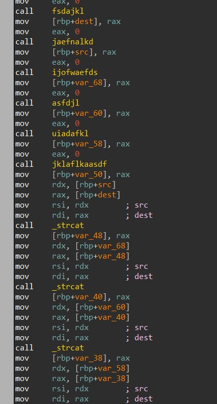

# CodeBreaker Challenge Mini CBC Competition 2021 Walkthrough

Here is a quick walkthrough of the challenges, most of these writeups are from my memory as I didn't keep detailed notes. Some of these answers may differ slightly from user to user, so attached are the files used 

### 0

The first challenge asks the user to join the discord server and post `!RFC2324`, in the general channel, then the CTF-Bot will give you the answer and a link to RFC2324.


### 1

In this challenge we are given a pcap and mention of RFC2324, *Hyper Text Coffee Pot Control Protocol*. It notes that there are specific method such as a regular HTTP server, in this case the `BREW` method.

Opening the PCAP and searching for the string brew brings us to a tcp connection and after following it, we can see the method being invoked and that the Coffee Pot is at 192.168.1.83 and the computer is at 192.168.1.82


### 2

For this challenge we are asked to decrypt the data and find the username and password that was encoded with `crypto.py`, we also have a `notes.txt`. Both of these files, are what I named them, I don't remember what they were originally called.

Looking through the crypto.py file, we can see that we are working with a RSA instance with P and Q being generated with 512 bits. While this is a smaller bit range it isn't much use to us as it will probably take too long to brute force it. Everything looks normal except for the encode function:

```python
def encode(key, p):
    e, n = key
    cipher = [pow(ord(char), e, n) for char in p]
    return cipher
```

Here we can see that we are returned a list of every character encoded separately with n and e. Normally when a message is encoded with RSA the message will be used as a whole and not separately, so we can attack this. Looking inside notes.txt we see the e,n, and the encoded string, character by character. The full solution can be found in solve.py, but the premise is to just brute force character by character and figure out which align to the corresponding characters from the encoded list. I did this lazily but creating a dictionary would probably be faster. 

If the reader still does not understand, the premise behind this is that every character should return a unique and static value and should always be the same for that character, n, and e combo. This is what allows us to just walk through each encoded character and find the corresponding decoded character 

Given us the username and password: `Username: owenryan Password: 3_Ws0IYe8q`

### 3

For this final challenge we are given a binary `challenge3_a_1.bin`, when I ran it I would get a segmentation fault but we are just going to ignore it and complete this challenge easily. Opening the file in Ida you can see several functions being called then several strcats follow with the memory locations that were used by the previous functions.



Looking into these functions, we can see that strings are just loaded form memory and the strcats will combine them... incorrectly, but we don't care. Copying out all the strings from the functions in order and base64 decoding them, you get the solution.


If you continue into the binary you can see another instance of what appears to be RSA occurring, but I didn't continue into it as this worked for the solution.